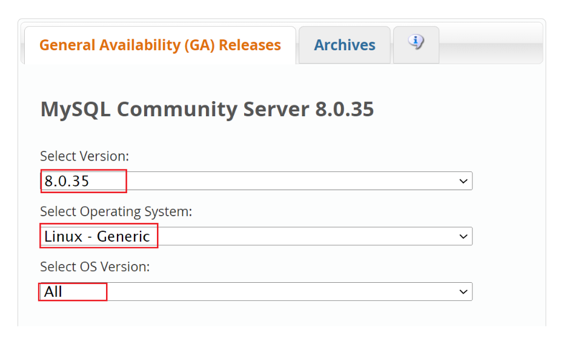
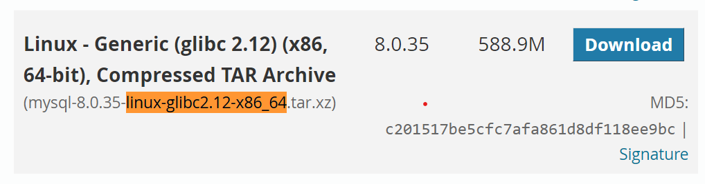

<p align="right">
<a href="#">  

</a>
</p>

<br/>

# MySQL Installation Using Binaries


This is published in order to share how to Install MySQL database using Binaries.
The official documentation can be found at <a href="https://dev.mysql.com/doc/refman/8.0/en/binary-installation.html"> dev.mysql.com </a>


## Download & Install Binaries Installer

Please download the file from official website https://dev.mysql.com/downloads/mysql/ and choose linux-glibc2.12-x86_64.



</br>



## MySQL Installation

```
cd /your_binaries_path
```

```
unxz file_name.tar.xz
```

```
tar -C /your_binaries_path/ -xvf file_name.tar
```

you can rename the extracted folder using this command ( Optional )

```
 mv /your_binaries_path/mysql-8.0.35-linux-glibc2.12-x86_64 /your_binaries_path/mysql8 
```


Makesure MySQL installation using this command mysql -v :

```
/your_binaries_path/mysql8/bin/mysql -V
```


## Database Folder Structure

    .
    your_basedir ( example: /apps )
    ├── ...
    ├── mysql                # mysql directry
    │   ├── cnf              # configuration file directory
    │   ├── datadir          # Data directory
    │   ├── logs             # Miscellaneous information
    │   └── tmp              # Temporary process directory
    │  
    └── ...

## Example Configuration File

Put this configuration file on <strong>cnf</strong> directory lets say name file is mysql.cnf


```
cd /apps/mysql/cnf

touch mysql.cnf

vi mysql.cnf
```

```
[mysqld]
socket=/apps/mysql/logs/mysql.sock
port=3306
datadir=/apps/mysql/datadir
basedir=/your_binaries_path/
tmpdir=/apps/mysql/tmp
log-error=/apps/mysql/logs/mysql.log
```

## BringUp DB
Firstly first if datadir directory is empty we need initializing the database directory using command below:

```
cd /your_binaries_path/mysql8

bin/mysqld --defaults-file=/path_to_configuration_file/mysql.cnf --initialize-insecure
```

## StartUp DB
Run the database using below :

```
cd /your_binaries_path/mysql8

bin/mysqld_safe --defaults-file=/path_to_configuration_file/mysql.cnf &
```


## References

https://dev.mysql.com/doc/refman/8.0/en/binary-installation.html

